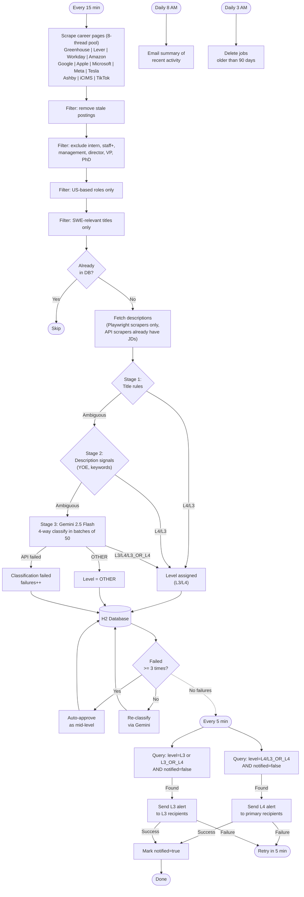

# SWE Job Notifier

Automated job posting monitor that scrapes career pages, filters for mid-level and entry-level software engineering roles in the US, classifies ambiguous titles via Gemini AI, and sends email alerts to separate recipient lists by level.

## How It Works

**Pipeline stages:**

1. **Scrape** — Polls 130+ company career pages every 15 minutes using an 8-thread pool. Playwright scrapers collect metadata only (title, URL, location) — descriptions are deferred to post-dedup. API scrapers include descriptions for free in the response.
2. **Pre-filter** — Removes stale postings, non-US locations, excluded titles (management, intern, staff+), and non-SWE roles
3. **Dedup** — Loads all known job keys into an in-memory set once per poll cycle for O(1) lookups (no per-job DB queries)
4. **Fetch descriptions** — Playwright scrapers (Google, Tesla, TikTok, iCIMS) open a fresh browser context and visit detail pages only for unseen jobs. This avoids fetching ~100 descriptions for already-seen jobs that would be discarded after dedup.
5. **Classify** — Three-stage `ClassificationPipeline` assigns a level (L3/L4/L3_OR_L4/OTHER) to each job. L4 and L3_OR_L4 are treated as mid-level for notifications.
   - **Stage 1 — Title rules:** Regex patterns ("SWE II" → L4, "SDE 1" → L3) and L3 keywords ("new grad", "junior", "entry level"). Zero-cost, high-confidence.
   - **Stage 2 — Description signals:** `SignalExtractor` parses YOE patterns from JDs ("3+ years" → L4, "0-1 years" → L3) and checks for L3 keywords. Still local, no API call.
   - **Stage 3 — Gemini LLM:** Remaining ambiguous jobs are sent to Gemini 2.5 Flash in batches of 50 for 4-way classification. `SignalExtractor` provides structured `Signal` records with ~200-char context snippets from 12 consolidated keywords.
6. **Persist** — All jobs batch-saved to H2 via `saveAll()` with batch-loaded existing rows (single query, no N+1); Gemini failures are retried on subsequent polls (auto-approved as L4 after 3 failures)
7. **Email alert** — Independent 5-minute scan sends L4 alerts to primary recipients and L3/new-grad alerts to a separate recipient list

### End-to-End Workflow



## Supported Platforms

| Platform | Method | Companies |
|----------|--------|-----------|
| **Greenhouse** (76) | JSON API | Stripe, Airbnb, Cloudflare, Datadog, Twilio, Figma, Discord, Coinbase, Robinhood, Pinterest, Dropbox, DoorDash, Instacart, Databricks, MongoDB, Elastic, GitLab, Roblox, Unity, Lyft, Block, Anthropic, Twitch, Okta, Duolingo, LinkedIn, GoDaddy, Epic Games, Roku, Reddit, Squarespace, Groupon, Yext, Thumbtack, Pure Storage, Lucid Motors, Jane Street, Nextdoor, SoFi, Coursera, Samsara, Verkada, Waymo, Scale AI, Brex, Rubrik, Applied Intuition, The Trade Desk, Lucid Software, Tower Research Capital, Geneva Trading, Bill.com, Qualtrics, ZipRecruiter, IXL Learning, Akuna Capital, Point72, Instabase, Chime, Otter.ai, Flexport, Affirm, Coupang, Ripple, Oscar, Aquatic Capital Management, Glean, Smartsheet, StubHub, IMC Trading, Nuro, Optiver, Appian, DRW, Jump Trading, Airtable |
| **Workday** (34) | JSON API | NVIDIA, Salesforce, Intel, Mastercard, Walmart, Adobe, Cisco, PayPal, Qualcomm, Snap, Broadcom, Visa, Dell, Micron, Zoom, Equinix, NXP, IQVIA, Slack, Proofpoint, Abbott, Blue Origin, Cadence, Capital One, Cox, CrowdStrike, HPE, Travelers, Applied Materials, Morgan Stanley, Genentech, GEICO, BlackRock, Bloomberg |
| **Lever** (9) | JSON API | Netflix, Spotify, Palantir, Plaid, Veeva, Zoox, Quantcast, Belvedere Trading, WeRide |
| **Ashby** (5) | JSON API | Whatnot, Notion, Confluent, OpenAI, Snowflake |
| **iCIMS** (1) | Playwright | Uber |
| **Amazon** | JSON API | Amazon |
| **Google** | Playwright | Google |
| **Apple** | Playwright | Apple |
| **Microsoft** | JSON API (PCSX) | Microsoft |
| **Meta** | GraphQL API | Meta |
| **Tesla** | Playwright | Tesla |
| **TikTok** | Playwright | TikTok |
| **SmartRecruiters** (1) | JSON API | ServiceNow |
| **OracleCloud** (2) | JSON API | JP Morgan, Fortinet |

## Prerequisites

- Java 21+
- Maven (wrapper included)
- Chromium (auto-installed by Playwright on first run — needed for Google, Apple, Tesla, TikTok, iCIMS, Uber scrapers)
- Gmail account with [App Password](https://myaccount.google.com/apppasswords)
- Gemini API key (optional — without it, all pre-filtered jobs are approved)

## Setup

1. Clone the repo and create a `.env` file:

```bash
cp .env.example .env  # or create manually
```

2. Configure environment variables in `.env`:

```properties
GEMINI_API_KEY=your-gemini-api-key
EMAIL_USERNAME=you@gmail.com
EMAIL_APP_PASSWORD=your-gmail-app-password
NOTIFICATION_EMAIL=recipient@example.com,another@example.com
NOTIFICATION_EMAIL_L3=newgrad@example.com
```

3. Start the application:

```bash
set -a && source .env && set +a && ./mvnw spring-boot:run
```

Or run in the background:

```bash
set -a && source .env && set +a && nohup ./mvnw spring-boot:run -q > /dev/null 2>&1 &
```

## Scheduled Jobs

| Job | Schedule | Description |
|-----|----------|-------------|
| **Poll** | Every 15 min | Scrape all companies (8-thread pool), filter, classify, persist |
| **Alert scan** | Every 5 min | Email unnotified L4 jobs to primary recipients, L3 jobs to L3 recipients |
| **Daily summary** | 8:00 AM | Summary email of recent activity |
| **Data cleanup** | 3:00 AM | Delete jobs older than 90 days |

## Project Structure

```
src/main/java/com/github/jingyangyu/swejobnotifier/
├── SweJobNotifierApplication.java          # Entry point
├── config/
│   ├── PlaywrightConfig.java               # Shared headless Chromium browser
│   ├── WebClientConfig.java                # Non-blocking HTTP client
│   ├── WorkdayProperties.java              # Workday company configs
│   ├── IcimsProperties.java                # iCIMS company configs
│   └── OracleCloudProperties.java          # OracleCloud company configs
├── controller/
│   └── ScrapeTestController.java           # Manual scrape trigger endpoint
├── model/
│   └── JobPosting.java                     # JPA entity
├── notification/
│   └── EmailNotifier.java                  # Gmail SMTP sender
├── repository/
│   └── JobPostingRepository.java           # Spring Data JPA
├── scraper/
│   ├── JobScraper.java                     # Scraper interface
│   ├── AmazonScraper.java                  # Amazon Jobs JSON API
│   ├── AppleScraper.java                   # Apple Careers (Playwright)
│   ├── AshbyScraper.java                   # Ashby API (Whatnot, Notion)
│   ├── GoogleScraper.java                  # Google Careers (Playwright)
│   ├── GreenhouseScraper.java              # Greenhouse JSON API (76 companies)
│   ├── IcimsScraper.java                   # iCIMS (Playwright)
│   ├── LeverScraper.java                   # Lever JSON API (9 companies)
│   ├── MetaScraper.java                    # Meta Careers GraphQL
│   ├── MicrosoftScraper.java               # Microsoft PCSX API
│   ├── OracleCloudScraper.java             # OracleCloud HCM API
│   ├── SmartRecruitersScraper.java         # SmartRecruiters API
│   ├── TeslaScraper.java                   # Tesla Careers (Playwright)
│   ├── TikTokScraper.java                  # TikTok Careers (Playwright)
│   └── WorkdayScraper.java                 # Workday API (27 companies)
├── service/
│   ├── JobPollingService.java              # Main orchestrator (15-min cycle)
│   ├── NotificationService.java            # Alert scanner (5-min cycle)
│   ├── DailySummaryService.java            # Daily digest email
│   ├── JobCleanupService.java              # 90-day retention cleanup
│   ├── PipelineMetrics.java                # Micrometer counters/gauges
│   └── classification/
│       ├── ClassificationPipeline.java     # 3-stage orchestrator: title → description → Gemini
│       ├── ClassificationResult.java       # Gemini response + level map
│       ├── FilterKeywords.java             # Title patterns (L3/L4) and excluded keywords
│       ├── GeminiClient.java               # Gemini API client (prompt building + HTTP)
│       ├── JobClassifier.java              # Batch Gemini classification with retry
│       ├── JobTitleFilter.java             # Pre-filters + title-based auto level classification
│       ├── Signal.java                     # Record: keyword + snippet + source (TITLE/DESCRIPTION)
│       └── SignalExtractor.java            # Signal extraction + YOE parsing + description inference
└── util/
    └── CsvUtil.java                        # CSV export utility
```

## Observability

### Metrics

Exposed via Spring Boot Actuator at `http://localhost:8080/actuator/metrics/job.*`:

- `job.gemini.calls` — Gemini API success/failure counts
- `job.gemini.retries` — Retry attempts
- `job.scrape` — Scrape success/failure counts
- `job.email` — Email delivery success/failure
- `job.pipeline.scraped` — Total jobs scraped
- `job.pipeline.classified` — Jobs classified as mid-level by Gemini
- `job.pipeline.auto_approved` — Jobs auto-approved by title filter
- `job.pipeline.auto_approved_fallback` — Jobs auto-approved after exhausting Gemini retries
- `job.poll.duration` — Poll cycle timing
- `job.unnotified` — Current unnotified job count (gauge)

### Logs

Rolling log files in `logs/app.log` with daily rotation, 30-day retention, and 500MB total size cap.

### Health Check

```bash
curl http://localhost:8080/actuator/health
```

## Configuration

All configuration is in `src/main/resources/application.properties`. Key settings:

| Property | Default | Description |
|----------|---------|-------------|
| `job.poll.cron` | `0 */15 * * * *` | Poll frequency |
| `job.notification.scan.cron` | `0 */5 * * * *` | Alert scan frequency (L4 + L3) |
| `job.summary.cron` | `0 0 8 * * *` | Daily summary time |
| `job.retention.days` | `90` | Days before job cleanup |
| `gemini.model` | `gemini-2.5-flash` | Gemini model for classification |
| `NOTIFICATION_EMAIL_L3` | *(empty)* | L3/new-grad alert recipients (comma-separated) |
| `spring.task.scheduling.pool.size` | `4` | Scheduler thread pool size |

## Tech Stack

- **Framework:** Spring Boot 4.0.5
- **Database:** H2 (file-based)
- **AI:** Google Gemini 2.5 Flash
- **Scraping:** WebClient (JSON APIs) + Playwright 1.52.0 (SPA career sites)
- **Email:** Spring Mail (Gmail SMTP)
- **Metrics:** Micrometer + Spring Boot Actuator
- **Build:** Maven with Spotless (Google Java Format AOSP)
