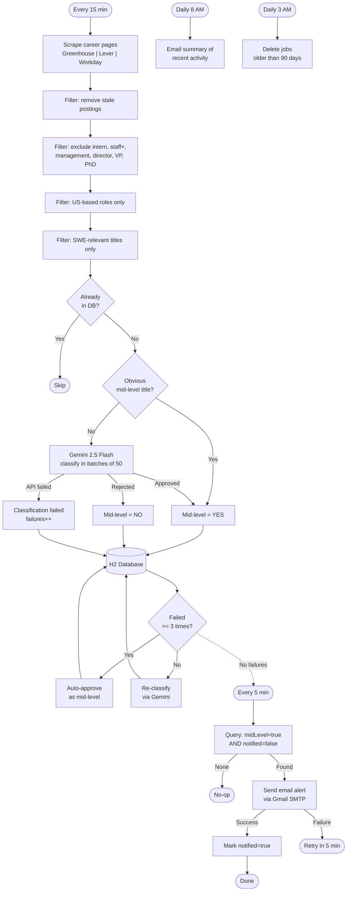

# SWE Job Notifier

Automated job posting monitor that scrapes career pages, filters for mid-level software engineering roles in the US, classifies ambiguous titles via Gemini AI, and sends email alerts.

## How It Works

**Pipeline stages:**

1. **Scrape** — Polls Greenhouse, Lever, and Workday career pages every 15 minutes
2. **Pre-filter** — Removes stale postings, non-US locations, excluded titles (management, intern, staff+), and non-SWE roles
3. **Dedup** — Skips jobs already in the database
4. **Auto-approve** — Titles containing "Software Engineer" (without senior/staff/principal qualifiers) are approved without AI
5. **Gemini classify** — Ambiguous titles are sent to Gemini 2.5 Flash in batches of 50 for mid-level classification
6. **Persist** — All jobs saved to H2 for dedup tracking; Gemini failures are retried on subsequent polls (auto-approved after 3 failures)
7. **Email alert** — Independent 5-minute scan sends alerts for any unnotified mid-level jobs

### End-to-End Workflow



## Supported Platforms

| Platform | API | Companies |
|----------|-----|-----------|
| **Greenhouse** | JSON board API | Stripe, Airbnb, Cloudflare, Datadog, Twilio, Figma, Discord, Coinbase, Robinhood, Pinterest, Dropbox, DoorDash, Instacart, Databricks, MongoDB, Elastic, GitLab, Roblox, Unity, Lyft, Block, Anthropic, Twitch, Okta, Duolingo |
| **Lever** | JSON postings API | Netflix, Spotify, Palantir, Plaid |
| **Workday** | Search API | NVIDIA, Salesforce, Intel, Mastercard, Walmart, Adobe, Cisco, PayPal, Qualcomm, Snap, Broadcom |

## Prerequisites

- Java 17+
- Maven (wrapper included)
- Gmail account with [App Password](https://myaccount.google.com/apppasswords)
- Gemini API key (optional — without it, all pre-filtered jobs are approved)

## Setup

1. Clone the repo and create a `.env` file:

```bash
cp .env.example .env  # or create manually
```

2. Configure environment variables in `.env`:

```properties
GEMINI_API_KEY=your-gemini-api-key
EMAIL_USERNAME=you@gmail.com
EMAIL_APP_PASSWORD=your-gmail-app-password
NOTIFICATION_EMAIL=recipient@example.com
```

3. Start the application:

```bash
set -a && source .env && set +a && ./mvnw spring-boot:run
```

Or run in the background:

```bash
set -a && source .env && set +a && nohup ./mvnw spring-boot:run -q > /dev/null 2>&1 &
```

## Scheduled Jobs

| Job | Schedule | Description |
|-----|----------|-------------|
| **Poll** | Every 15 min | Scrape, filter, classify, persist |
| **Alert scan** | Every 5 min | Email unnotified mid-level jobs |
| **Daily summary** | 8:00 AM | Summary email of recent activity |
| **Data cleanup** | 3:00 AM | Delete jobs older than 90 days |

## Observability

### Metrics

Exposed via Spring Boot Actuator at `http://localhost:8080/actuator/metrics/job.*`:

- `job.gemini.calls` — Gemini API success/failure counts
- `job.gemini.retries` — Retry attempts
- `job.scrape` — Scrape success/failure counts
- `job.email` — Email delivery success/failure
- `job.pipeline.scraped` — Total jobs scraped
- `job.pipeline.classified` — Jobs classified as mid-level by Gemini
- `job.pipeline.auto_approved` — Jobs auto-approved by title filter
- `job.pipeline.auto_approved_fallback` — Jobs auto-approved after exhausting Gemini retries
- `job.poll.duration` — Poll cycle timing
- `job.unnotified` — Current unnotified job count (gauge)

### Logs

Rolling log files in `logs/app.log` with daily rotation, 30-day retention, and 500MB total size cap.

### Health Check

```bash
curl http://localhost:8080/actuator/health
```

## Configuration

All configuration is in `src/main/resources/application.properties`. Key settings:

| Property | Default | Description |
|----------|---------|-------------|
| `job.poll.cron` | `0 */15 * * * *` | Poll frequency |
| `job.notification.scan.cron` | `0 */5 * * * *` | Alert scan frequency |
| `job.summary.cron` | `0 0 8 * * *` | Daily summary time |
| `job.retention.days` | `90` | Days before job cleanup |
| `gemini.model` | `gemini-2.5-flash` | Gemini model for classification |

## Tech Stack

- **Framework:** Spring Boot 4.0.5
- **Database:** H2 (file-based)
- **AI:** Google Gemini 2.5 Flash
- **Email:** Spring Mail (Gmail SMTP)
- **Metrics:** Micrometer + Spring Boot Actuator
- **Build:** Maven
